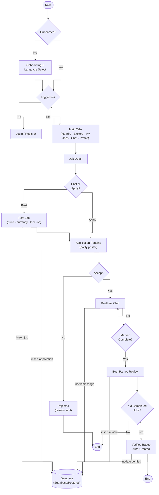
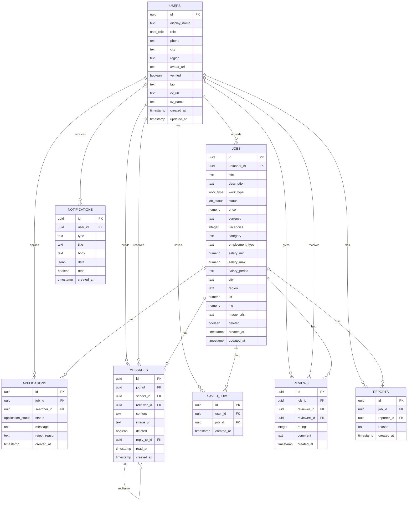
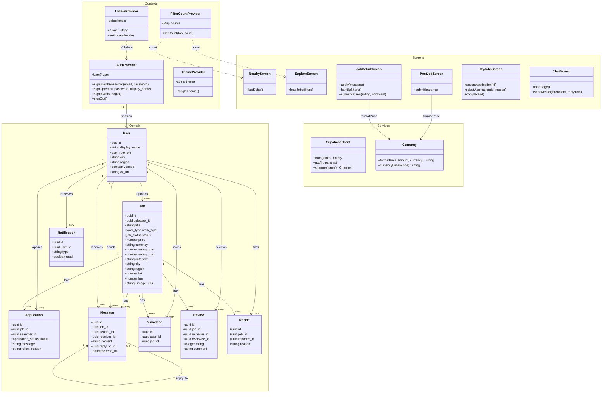
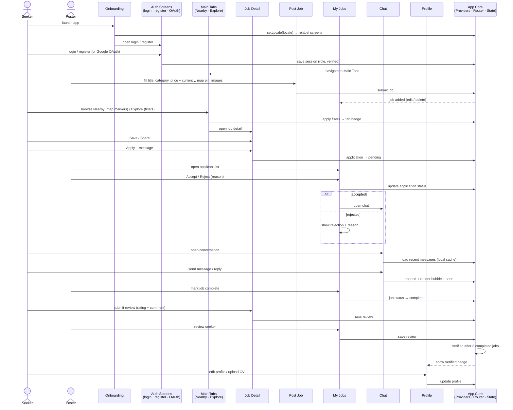
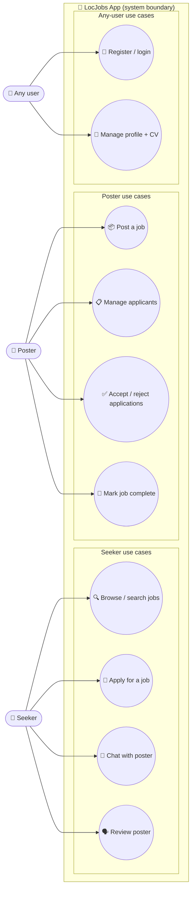

# LocJobs — Diagrams

All diagrams for the LocJobs app in one file: full app flowchart, ER diagram, class diagram, sequence diagram, use-case diagram, and the database tables.

---

## 1. Full App Flowchart

One flowchart for the whole app. Shape legend:

| Shape | Meaning |
|-------|---------|
| `[ box ]` | Process / action |
| `{ diamond }` | Decision (Yes / No) |
| `( [ stadium ] )` | Start / End |

---

## 2. ER Diagram

---

## 3. Class Diagram

A medium-size diagram covering the app: the 8 domain entities, the 4 context providers, the key services, and the main screens — grouped into namespaces.

Cross-cutting wiring (not drawn, to keep lines from overlapping): all screens read/write through the **SupabaseClient** (REST · RPC · Realtime); **ThemeProvider** supplies theme styles to the screens; **AuthProvider** mounts **NetworkBanner**; `JobDetailScreen`/`MyJobsScreen` render **ReviewCard**; `PostJobScreen`/`ExploreScreen` open **PickerModal**.

---

## 4. Sequence Diagram

One diagram covers the whole frontend app flow in order: onboarding & auth → post a job → browse / save / share → apply → accept / reject → chat → complete → review → verified badge. Every screen is its own lifeline; all interactions stay inside the React Native app — no Supabase shown.

---

## 5. Use-Case Diagram

Mermaid has no native use-case diagram, so this uses a flowchart with actors `( ( actor ) )` and use-case ellipses `( ( use case ) )` inside the system boundary.

---

## 6. Database Tables

Enums: `user_role` (`both`, …), `work_type` (`onsite`, …), `job_status` (`open`, `full`, `completed`, …), `application_status` (`pending`, `accepted`, `rejected`).

### users

| Column | Type | Constraints |
|--------|------|-------------|
| id | uuid | PK → auth.users(id) |
| display_name | text | |
| role | user_role | default `both` |
| location | text | |
| city | text | |
| region | text | |
| phone | text | |
| created_at | timestamptz | default now() |
| updated_at | timestamptz | default now() |
| avatar_url | text | |
| verified | boolean | default false |
| bio | text | |
| deleted_at | timestamptz | |
| cv_url | text | |
| cv_name | text | |

### jobs

| Column | Type | Constraints |
|--------|------|-------------|
| id | uuid | PK, default gen_random_uuid() |
| uploader_id | uuid | FK → users(id) |
| title | text | NOT NULL |
| description | text | |
| work_type | work_type | default `onsite` |
| location | text | |
| address | text | |
| city | text | |
| region | text | |
| status | job_status | default `open` |
| price | numeric | |
| created_at | timestamptz | default now() |
| updated_at | timestamptz | default now() |
| image_urls | text[] | default `{}` |
| lat | double precision | |
| lng | double precision | |
| vacancies | integer | default 1 |
| category | text | |
| deleted | boolean | default false |
| employment_type | text | |
| salary_min | numeric | |
| salary_max | numeric | |
| salary_period | text | |
| currency | text | NOT NULL default `MMK` |

### applications

| Column | Type | Constraints |
|--------|------|-------------|
| id | uuid | PK, default gen_random_uuid() |
| job_id | uuid | FK → jobs(id) |
| searcher_id | uuid | FK → users(id) |
| created_at | timestamptz | default now() |
| status | application_status | default `pending` |
| message | text | |
| reject_reason | text | |

### messages

| Column | Type | Constraints |
|--------|------|-------------|
| id | uuid | PK, default gen_random_uuid() |
| job_id | uuid | FK → jobs(id) |
| sender_id | uuid | FK → users(id) |
| receiver_id | uuid | FK → users(id) |
| content | text | NOT NULL |
| created_at | timestamptz | default now() |
| image_url | text | |
| edited_at | timestamptz | |
| deleted | boolean | default false |
| reply_to_id | uuid | FK → messages(id) |
| read_at | timestamptz | |

### notifications

| Column | Type | Constraints |
|--------|------|-------------|
| id | uuid | PK, default gen_random_uuid() |
| user_id | uuid | FK → users(id) |
| type | text | NOT NULL |
| title | text | NOT NULL |
| body | text | NOT NULL |
| data | jsonb | default `{}` |
| read | boolean | default false |
| created_at | timestamptz | default now() |

### saved_jobs

| Column | Type | Constraints |
|--------|------|-------------|
| id | uuid | PK, default gen_random_uuid() |
| user_id | uuid | FK → users(id) |
| job_id | uuid | FK → jobs(id) |
| created_at | timestamptz | default now() |

### reviews

| Column | Type | Constraints |
|--------|------|-------------|
| id | uuid | PK, default gen_random_uuid() |
| job_id | uuid | FK → jobs(id) |
| reviewer_id | uuid | FK → users(id) |
| reviewee_id | uuid | FK → users(id) |
| rating | integer | CHECK 1–5 |
| comment | text | |
| created_at | timestamptz | default now() |

### reports

| Column | Type | Constraints |
|--------|------|-------------|
| id | uuid | PK, default gen_random_uuid() |
| job_id | uuid | FK → jobs(id) |
| reporter_id | uuid | FK → users(id) |
| reason | text | NOT NULL |
| created_at | timestamptz | default now() |
