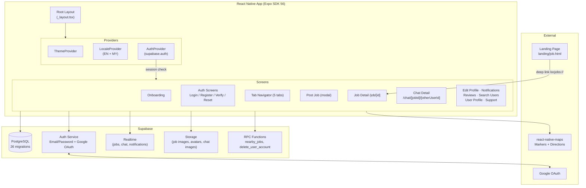
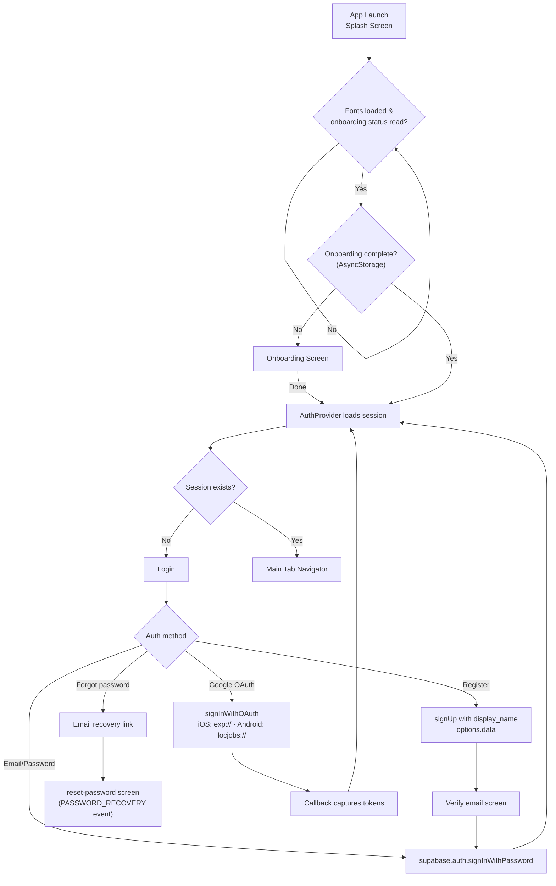
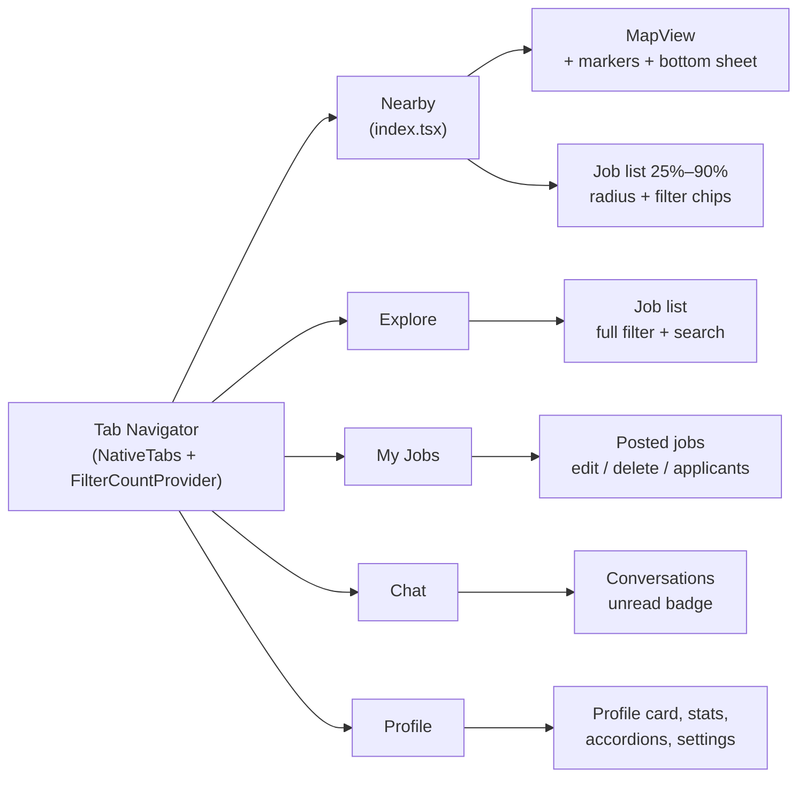
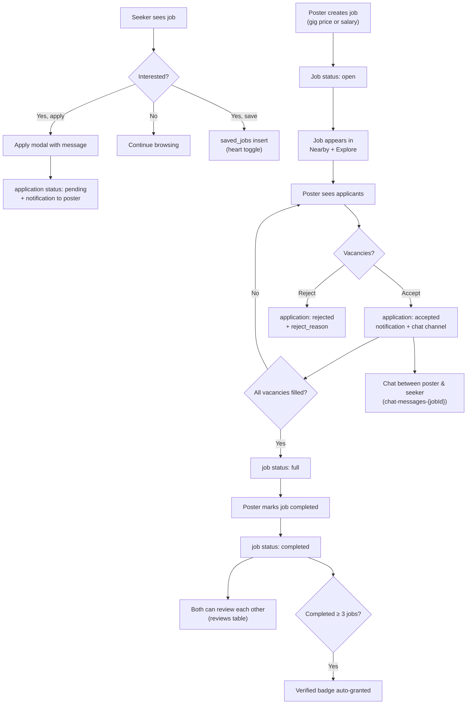
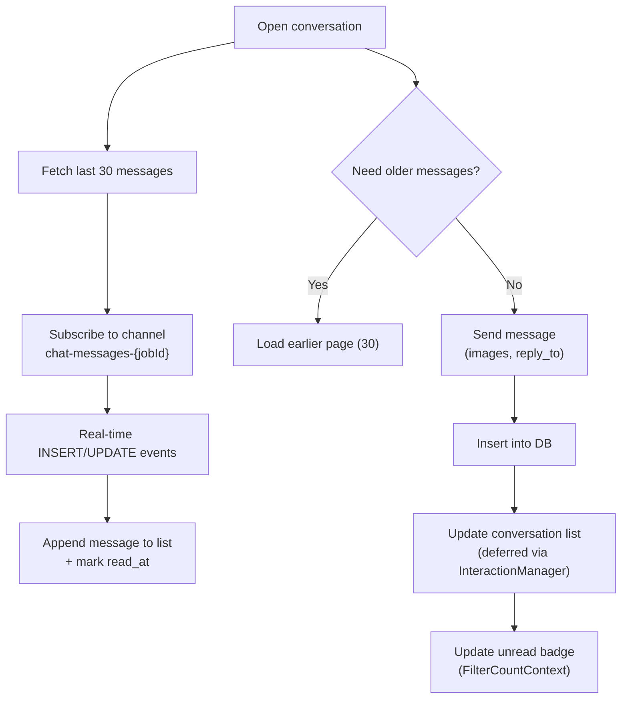
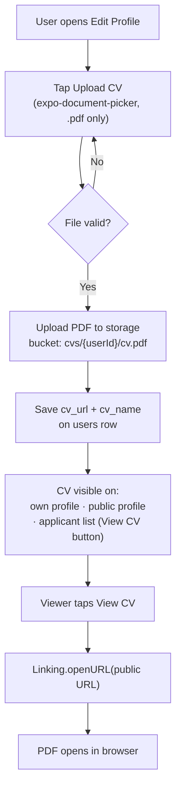
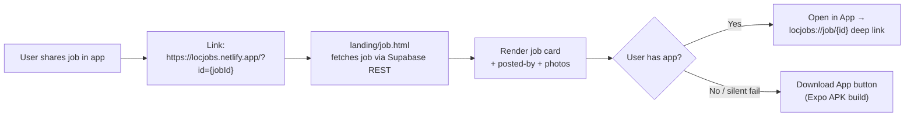
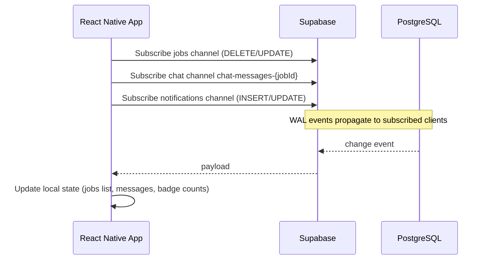

# LocJobs — Flowcharts

System and user-flow diagrams for the LocJobs app.

## 1. App Architecture Overview

## 2. Launch, Onboarding & Auth Flow

## 3. Main Tabs Structure

## 4. Job Lifecycle — Seeker & Poster

## 5. Real-time Chat Flow

## 6. CV / Resume Upload & Viewing

## 7. Job Sharing & Landing Page

## 8. Data Flow — Real-time Sync

