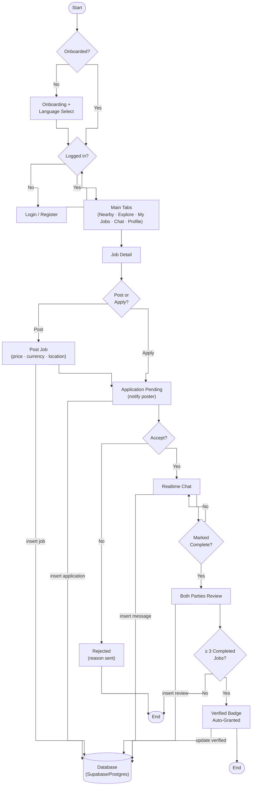
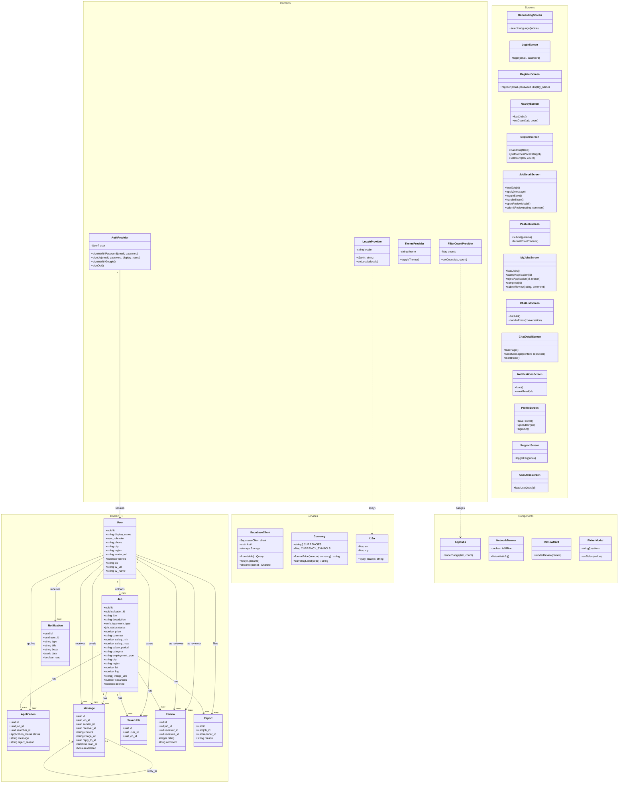
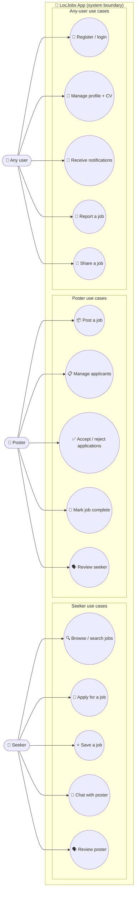
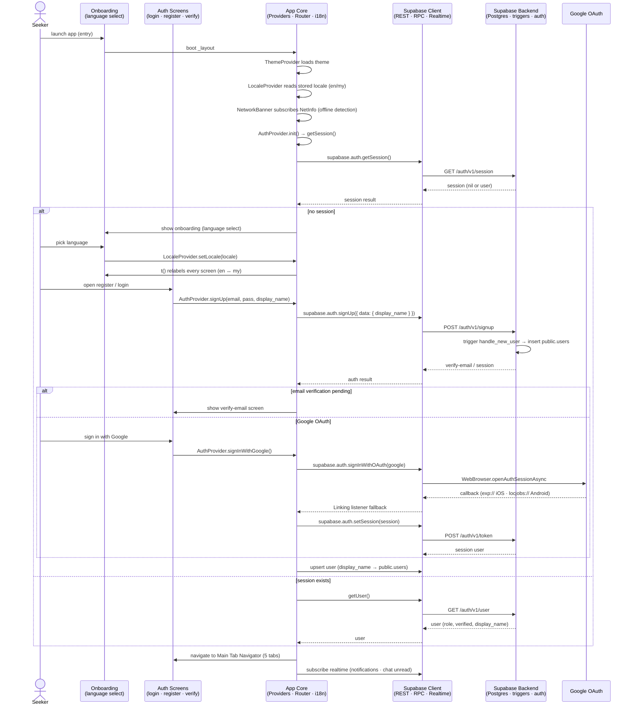
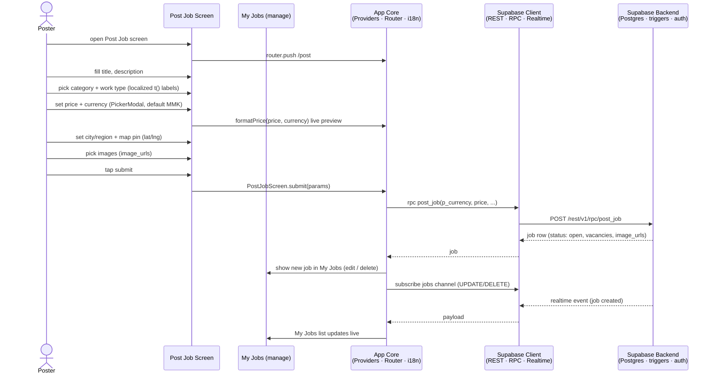
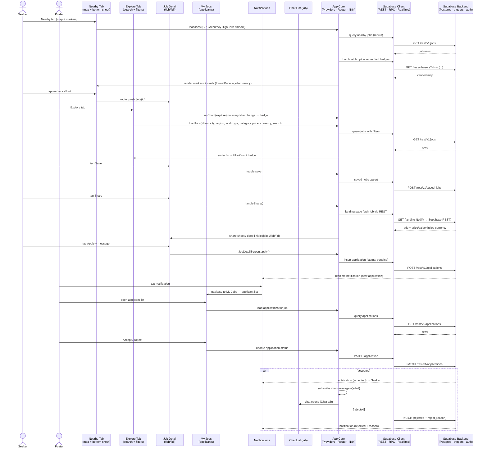
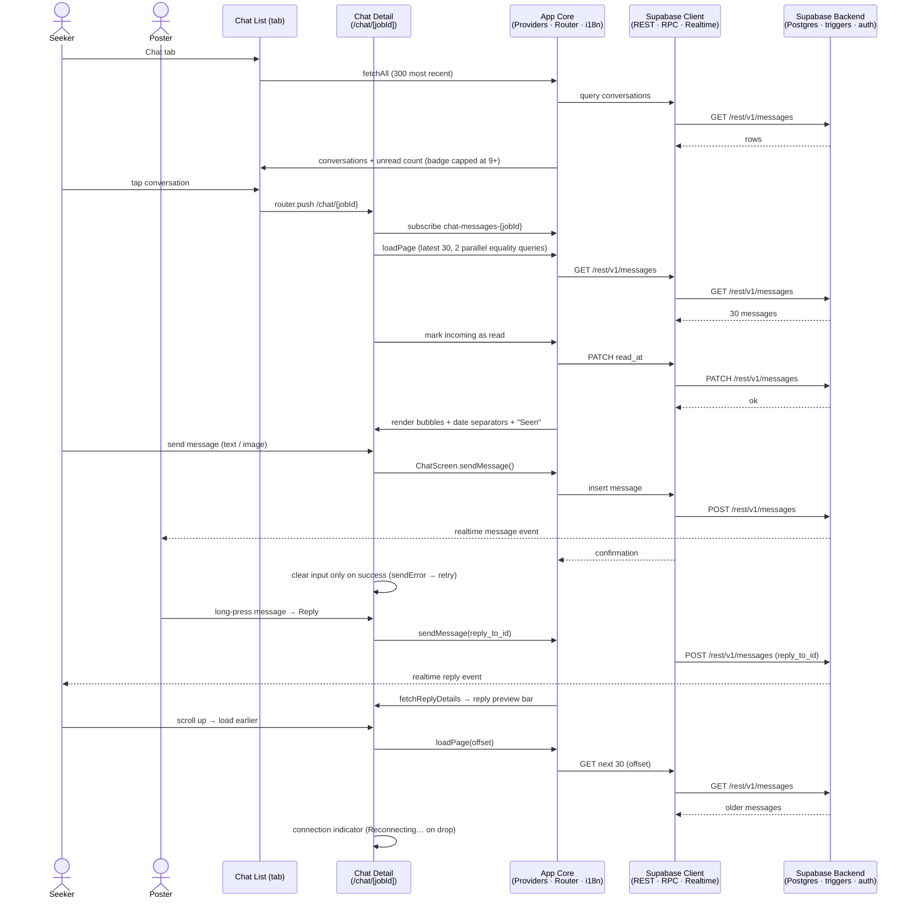
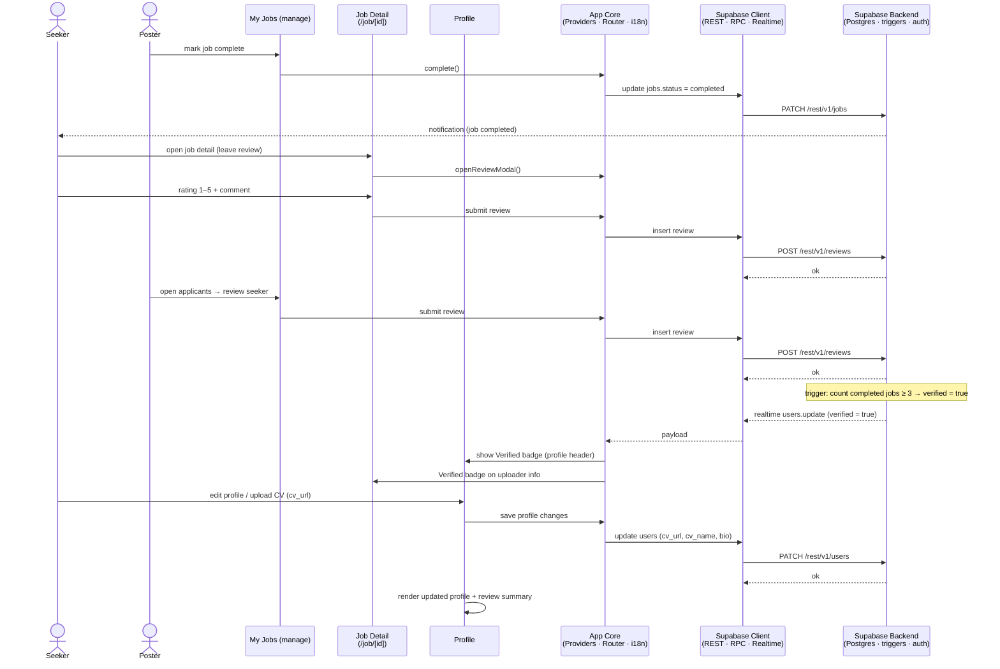
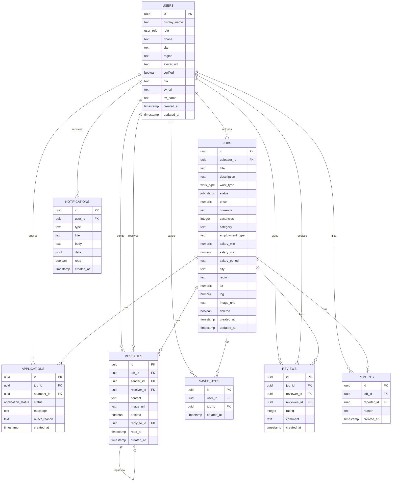

# LocJobs — Final Project Report

A location-based local job matching mobile application for Myanmar.

---

# Chapter 1 — Introduction

## 1.1 Business Concept

LocJobs is a mobile application that connects local job seekers with job posters (employers) in Myanmar. It is built around the idea of **hyperlocal job matching**: instead of browsing generic job boards, a seeker opens a map and sees jobs posted near their current location — a cleaner shop, a delivery runner, a construction helper, a stall assistant, and so on.

The business model is a **two-sided marketplace**:

- **Seekers** browse a map and a searchable feed, filter jobs by category, region/city, price and currency, apply directly with a message, and chat in real time with the poster once accepted.
- **Posters** post a job with a price or salary, choose their currency, mark a map pin, receive applications, accept or reject applicants with a reason, mark jobs complete, and review the seeker.

LocJobs removes the middleman: there is no agency fee and no telephone tag. Both sides communicate directly inside the app through realtime chat, building trust through a **verified badge** (auto-granted after completing 3+ jobs) and a **two-way review system**.

The app is fully bilingual (English / Myanmar) and **multi-currency** (MMK, USD, EUR, GBP, SGD, THB, JPY, KRW, CNY, INR), because jobs in Myanmar are priced in different currencies depending on the industry and employer.

## 1.2 Problem Statement

Finding local work in Myanmar today is fragmented and unsafe:

1. **No centralized, structured source.** Jobs are scattered across word of mouth, newspapers, and Facebook groups. Posts are unstructured, quickly buried, and not searchable.
2. **No location awareness.** A seeker cannot easily see "what jobs are near me right now." They must manually filter posts that are mostly from far-away townships.
3. **Trust and fraud risk.** There is no identity verification, no rating history, and no formal acceptance flow. Seekers often pay agency fees or fall for fake "job offers."
4. **Payment confusion.** Salaries are quoted in different currencies (Ks, $, Baht, SGD, …) with no consistent way to compare.
5. **Language barrier.** Most job information is only available in one language, excluding either Myanmar-only or English-only users.
6. **No communication trail.** Negotiation happens over private phone calls or Messenger, with no record of what was agreed.

A mobile app that combines a map, structured job posts, a formal application/acceptance workflow, realtime chat, reviews, and verification directly addresses each of these problems.

## 1.3 Purpose of the Project

The purpose of this project is to design and develop **LocJobs**, a cross-platform mobile application that:

- Lets a seeker discover nearby jobs visually on a map and through a filterable feed;
- Lets a poster publish a job in minutes with price/salary, currency, category, and location;
- Provides a structured end-to-end workflow — *apply → accept/reject → chat → complete → review → verified badge*;
- Keeps all communication and history inside the app through realtime messaging;
- Supports both English and Myanmar languages, and multiple currencies, so it is usable by a wide audience;
- Is built on a modern, scalable stack (Expo / React Native + Supabase) so it can grow into a production product.

The project also serves as a complete exercise in full-stack mobile development: product design, database design, authentication, realtime data, offline handling, localization, and deployment.

## 1.4 Project Objectives

The project sets the following objectives:

1. **Build a cross-platform mobile app** using Expo SDK 56, Expo Router, React Native and TypeScript that runs on iOS and Android from a single codebase.
2. **Implement a Supabase backend** (PostgreSQL, Auth, Realtime, Storage) with a clean schema of 8 tables and 4 enums, plus Row Level Security policies.
3. **Provide location-based discovery** — a map with job markers and a "Nearby" experience using GPS (`Accuracy.High`, 20s timeout) and a radius.
4. **Provide a searchable, filterable Explore feed** — filters for city, region, work type, category, employment type, price range, currency, and text search, with a live filter-count badge on the tabs.
5. **Implement the full application workflow** — apply (pending) → poster accepts (chat opens) or rejects (with reason), with realtime notifications at each step.
6. **Deliver realtime chat** — channel-based messaging with pagination (30 per page), reply-to-message, read receipts ("Seen"), image messages, and unread badges.
7. **Implement trust features** — two-way reviews (rating 1–5 + comment) and an auto-granted **verified badge** after 3+ completed jobs.
8. **Localize the entire UI** (English / Myanmar) and support **10 currencies** with consistent price formatting everywhere.
9. **Support job images, CV upload, saved jobs, reports, and a shareable landing page** with deep linking back into the app.
10. **Handle the non-happy paths** — offline banner, error + retry UI, loading states, and graceful network failures.

## 1.5 Scope and Limitation of the Project

### Scope

The project covers:

- A complete user lifecycle: onboarding, register/login (email + Google OAuth), profile management, CV upload, verified badge.
- A complete job lifecycle: post, browse (map + feed), save, share, apply, accept/reject, mark complete, review.
- Realtime features: chat, notifications, and live list updates when jobs change.
- Admin-light moderation: users can report jobs; jobs can be hidden/deleted.
- A public web landing page (Netlify) that renders any job and deep-links into the app.

### Limitations

The project has the following known limitations:

1. **No push notifications.** Notifications are in-app only (Supabase realtime). True OS push notifications (FCM/APNs via expo-notifications) are out of scope.
2. **No payment processing.** LocJobs matches seekers and posters but does not handle payments, escrow, or commissions. Payment is settled directly between the two parties.
3. **No offline mode.** The app needs a network connection; only a banner and retry states are provided, not full offline caching.
4. **No advanced matching/AI.** Recommendations are simple (map proximity + filters), not machine-learning-based.
5. **Verification is activity-based, not identity-based.** The verified badge counts completed jobs; it does not verify national ID, phone number, or business registration.
6. **Two-way street notifications.** Both parties receive in-app notifications; there is no email/SMS notification channel.
7. **Single-region launch design.** Cities and regions in the seed data target Myanmar; expanding internationally requires more data and currency/region configuration.
8. **No web admin dashboard.** Moderation/report review is done directly in the Supabase dashboard, not through a custom admin UI.

## 1.6 Project Overview

This report is organized as follows:

- **Chapter 1 (this chapter)** introduces the business concept, the problem being solved, the purpose, the objectives, and the scope and limitations.
- **Chapter 2 — System Design** presents the design of the system: the full application flowchart, class diagram, use-case diagram, sequence diagrams (one per phase of the app flow), the entity-relationship diagram, and the database tables.
- **Chapter 3 — Implementation** describes the technology stack, the architecture, and how each feature was actually built, including the key screens, contexts, services, and database layer.
- **Chapter 4 — Conclusion** closes the report with the conclusion, lessons learned during development, and possible future extensions.

---

# Chapter 2 — System Design

This chapter presents the system design of LocJobs. The design is described with six artifacts: a full application flowchart, a class diagram, a use-case diagram, sequence diagrams for each phase of the application flow, an entity-relationship diagram, and the database tables.

## 2.1 Flowchart Diagram

The flowchart below models the entire application flow, from app launch to the verified-badge flow. Shape legend: `[box]` = process/action, `{diamond}` = decision, `(["stadium"])` = start/end.

## 2.2 Class Diagram

The class diagram fully covers the app: all 8 domain entities (mirroring the database), the context providers, the services (Supabase client, currency, i18n), every screen, and the shared components — grouped into namespaces, with 1-to-many cardinality on the entity relationships.

Only the domain and provider relations above are drawn as edges, to keep the lines from overlapping. Cross-cutting wiring (not drawn): all screens read/write through the **SupabaseClient** (REST · RPC · Realtime); **ThemeProvider** supplies theme styles to `AppTabs` and the screens; screens format prices with **Currency** (`formatPrice`); `PostJobScreen`/`ExploreScreen` open **PickerModal**; `JobDetailScreen`/`MyJobsScreen` render **ReviewCard**; **AuthProvider** mounts **NetworkBanner**.

## 2.3 Use-Case Diagram

The use-case diagram identifies three actors — **Seeker**, **Poster**, and **Any user** — and the use cases each of them can perform inside the system boundary.

## 2.4 Sequence Diagram

The RN app is modelled at three layers — **screens**, **App Core** (providers · router · i18n) and the **Supabase Client** (REST · RPC · Realtime) — with each screen as its own lifeline. The full application flow is split into five phases, each with its own sequence diagram.

### 2.4.1 Phase 1 — Onboarding & Auth

### 2.4.2 Phase 2 — Posting a Job

### 2.4.3 Phase 3 — Browse, Save, Share, Apply

### 2.4.4 Phase 4 — Realtime Chat

### 2.4.5 Phase 5 — Complete, Review, Verified Badge

## 2.5 Entity Relationship Diagram

The ER diagram models the eight database tables and their relationships: `users`, `jobs`, `applications`, `messages`, `notifications`, `saved_jobs`, `reviews`, and `reports`.

## 2.6 Database Tables

The database uses four enums: `user_role` (`both`, …), `work_type` (`onsite`, …), `job_status` (`open`, `full`, `completed`, …) and `application_status` (`pending`, `accepted`, `rejected`). All tables are defined below.

### users

| Column | Type | Constraints |
|--------|------|-------------|
| id | uuid | PK → auth.users(id) |
| display_name | text | |
| role | user_role | default `both` |
| location | text | |
| city | text | |
| region | text | |
| phone | text | |
| created_at | timestamptz | default now() |
| updated_at | timestamptz | default now() |
| avatar_url | text | |
| verified | boolean | default false |
| bio | text | |
| deleted_at | timestamptz | |
| cv_url | text | |
| cv_name | text | |

### jobs

| Column | Type | Constraints |
|--------|------|-------------|
| id | uuid | PK, default gen_random_uuid() |
| uploader_id | uuid | FK → users(id) |
| title | text | NOT NULL |
| description | text | |
| work_type | work_type | default `onsite` |
| location | text | |
| address | text | |
| city | text | |
| region | text | |
| status | job_status | default `open` |
| price | numeric | |
| created_at | timestamptz | default now() |
| updated_at | timestamptz | default now() |
| image_urls | text[] | default `{}` |
| lat | double precision | |
| lng | double precision | |
| vacancies | integer | default 1 |
| category | text | |
| deleted | boolean | default false |
| employment_type | text | |
| salary_min | numeric | |
| salary_max | numeric | |
| salary_period | text | |
| currency | text | NOT NULL default `MMK` |

### applications

| Column | Type | Constraints |
|--------|------|-------------|
| id | uuid | PK, default gen_random_uuid() |
| job_id | uuid | FK → jobs(id) |
| searcher_id | uuid | FK → users(id) |
| created_at | timestamptz | default now() |
| status | application_status | default `pending` |
| message | text | |
| reject_reason | text | |

### messages

| Column | Type | Constraints |
|--------|------|-------------|
| id | uuid | PK, default gen_random_uuid() |
| job_id | uuid | FK → jobs(id) |
| sender_id | uuid | FK → users(id) |
| receiver_id | uuid | FK → users(id) |
| content | text | NOT NULL |
| created_at | timestamptz | default now() |
| image_url | text | |
| edited_at | timestamptz | |
| deleted | boolean | default false |
| reply_to_id | uuid | FK → messages(id) |
| read_at | timestamptz | |

### notifications

| Column | Type | Constraints |
|--------|------|-------------|
| id | uuid | PK, default gen_random_uuid() |
| user_id | uuid | FK → users(id) |
| type | text | NOT NULL |
| title | text | NOT NULL |
| body | text | NOT NULL |
| data | jsonb | default `{}` |
| read | boolean | default false |
| created_at | timestamptz | default now() |

### saved_jobs

| Column | Type | Constraints |
|--------|------|-------------|
| id | uuid | PK, default gen_random_uuid() |
| user_id | uuid | FK → users(id) |
| job_id | uuid | FK → jobs(id) |
| created_at | timestamptz | default now() |

### reviews

| Column | Type | Constraints |
|--------|------|-------------|
| id | uuid | PK, default gen_random_uuid() |
| job_id | uuid | FK → jobs(id) |
| reviewer_id | uuid | FK → users(id) |
| reviewee_id | uuid | FK → users(id) |
| rating | integer | CHECK 1–5 |
| comment | text | |
| created_at | timestamptz | default now() |

### reports

| Column | Type | Constraints |
|--------|------|-------------|
| id | uuid | PK, default gen_random_uuid() |
| job_id | uuid | FK → jobs(id) |
| reporter_id | uuid | FK → users(id) |
| reason | text | NOT NULL |
| created_at | timestamptz | default now() |

---

# Chapter 3 — Implementation

## 3.1 Technology Stack

LocJobs is a full-stack mobile application built on the following technologies:

| Layer | Technology |
|-------|-----------|
| Frontend framework | React Native via **Expo SDK 56** |
| Navigation | **Expo Router** (file-based routing) |
| Language | **TypeScript** |
| Maps | `react-native-maps` (markers, callouts, bottom sheet) |
| Backend | **Supabase** (PostgreSQL, Auth, Realtime, Storage) |
| Auth | Supabase Auth — email/password + **Google OAuth** |
| Localization | Custom i18n layer (`en.ts` / `my.ts`) with a `LocaleProvider` |
| Networking/state | Supabase JS client + React Context providers |
| Image handling | `expo-image-picker` |
| Storage | Supabase Storage (job images, CV uploads) |

## 3.2 Architecture

The app follows a layered architecture:

- **`src/app/`** — Expo Router file-based screens, e.g. `(tabs)/index.tsx` (Nearby), `(tabs)/explore.tsx`, `(tabs)/my-jobs.tsx`, `(tabs)/chat.tsx`, `(tabs)/profile.tsx`, `job/[id].tsx`, `post.tsx`, `chat/[jobId].tsx`, `(auth)/*`, `notifications.tsx`, `support.tsx`, `user/[id]/*`.
- **`src/contexts/`** — global state providers: `AuthProvider`, `LocaleProvider`, `ThemeProvider`, and `FilterCountProvider`.
- **`src/components/`** — reusable UI, including `app-tabs.tsx` (tab navigator with badges) and `network-banner.tsx` (offline detection).
- **`src/lib/`** — domain helpers: `currency.ts` (`CURRENCIES`, `CURRENCY_SYMBOLS`, `formatPrice`, `currencyLabel`), the i18n dictionaries, and the Supabase client.

Data flows one way: screens call App Core (contexts/services), which calls the Supabase Client, which talks to Supabase. Realtime channels push events back to the App Core, which updates screens live.

## 3.3 Implemented Features

### 3.3.1 Authentication & Onboarding

- Email/password register, login, forgot password, and Google OAuth (platform-specific redirect URLs: `exp://auth/callback` for iOS Expo Go, `locjobs://auth/callback` for Android dev builds).
- `handle_new_user` DB trigger inserts the display name into `public.users` immediately on signup.
- Onboarding with language selection; all UI strings go through `t()` so the app switches between English and Myanmar instantly.

### 3.3.2 Job Posting

- Post Job form: title, description, category, work type, employment type, price + **currency picker**, city/region pickers, a map for the location pin, and multiple job images.
- Submits via the `post_job` RPC, which accepts `p_currency` and sets `currency` on the job row.

### 3.3.3 Job Discovery (Map + Feed)

- **Nearby**: full-screen map with job markers; tapping a callout opens the job detail. GPS is fetched with `Accuracy.High` and a 20s timeout. Jobs are loaded within a radius; category and work-type chips filter the map.
- **Explore**: a searchable, filterable feed. Filters include city, region, work type, category, employment type, min/max price (matched against `price`, `salary_min`/`salary_max`, or the salary interval), and **currency**. Every filter change updates a live badge count on the tab icon via `FilterCountContext`.
- Verified uploader badges are batch-fetched from `users` per screen and shown on cards.
- Real-time job updates: both Nearby and Explore subscribe to the `jobs` channel so deleted/updated jobs disappear without a manual refresh.

### 3.3.4 Save, Share & Landing Page

- Saved jobs toggle persists to `saved_jobs`.
- Sharing opens a public landing page (Netlify) that fetches the job via Supabase REST and renders the title and price/salary **in the job's currency**, then deep-links back with `locjobs://job/{id}` (or prompts a download).

### 3.3.5 Application Workflow

- Seeker applies with a message → `application_status: pending` → poster is notified in real time.
- Poster accepts (chat channel `chat-messages-{jobId}` opens) or rejects (with `reject_reason`, which the seeker is notified about).
- Both sides see application status badges; the applicant list lives in My Jobs.

### 3.3.6 Realtime Chat

- Channel-based chat with a stable `chat-messages-{jobId}` channel name.
- Pagination: latest 30 messages, then older pages of 30 via a scroll-to-top trigger.
- Long-press to **reply** to a message (`reply_to_id`), with a quoted preview bar.
- **Read receipts** (`read_at`) — unread messages are marked read when the chat opens, and own messages show "Seen".
- Image messages, connection indicator ("Reconnecting…"), and a send-error retry state.
- Chat list is capped at the 300 most recent messages for performance; unread totals drive the chat tab badge (capped at "9+").

### 3.3.7 Job Completion, Reviews & Verified Badge

- The poster marks a job complete; both parties then review each other (rating 1–5 + comment).
- A DB trigger counts completed jobs; once a user has **3+ completed jobs**, the `verified` flag is set to `true` automatically and a **Verified badge** is shown in the profile and on job cards.

### 3.3.8 Profile, CV & Notifications

- Profile editing (name, bio, phone, city/region, avatar) and **CV upload** (`cv_url`/`cv_name`).
- User profile screens (`user/[id]/index.tsx` and `user/[id]/jobs.tsx`) show another user's profile and up to 3 jobs with a "See all jobs" link.
- In-app notifications for applications, accept/reject, and job completion; unread badge on the tab. Notifications are marked read only when tapped.

### 3.3.9 Cross-Cutting Features

- **Localization sweep**: categories, employment types, ~15 regions, ~290 cities, and work types all render via `t()` with reverse-lookup so the DB still stores English keys.
- **Multi-currency**: `formatPrice(amount, currency)` renders e.g. `100,000 Ks` or `500 $` on every card, detail, profile, and landing page.
- **Offline detection**: a `NetworkBanner` (NetInfo) slides in when offline, in the active language.
- **Error + retry UI**: fetch failures show a retry button instead of a blank screen.
- **FAQ / Contact Us**: an i18n support screen with collapsible FAQ accordion.

## 3.4 Database Layer

- 8 tables (`users`, `jobs`, `applications`, `messages`, `notifications`, `saved_jobs`, `reviews`, `reports`) and 4 enums, managed through versioned Supabase migrations (`00001` … `00028`).
- Notable migrations include `00024` (reply + read receipts), `00025` (chat query composite index), `00027` (CV upload columns), and `00028` (`jobs.currency` + `post_job` RPC with `p_currency`).
- Row Level Security restricts reads/writes to authenticated participants (e.g. chat `read_at` can be updated by both participants).

---

# Chapter 4 — Conclusion

## 4.1 Conclusion

LocJobs was successfully designed and implemented as a location-based local job matching application for Myanmar. The project delivered a cross-platform mobile app (Expo / React Native + TypeScript) backed by Supabase, with the complete core workflow — a seeker discovers a job on a map, applies with a message, and once accepted, negotiates in realtime chat; the poster manages applicants, accepts or rejects with a reason, marks the job complete, and both sides review each other. The verified-badge system closes the loop by rewarding users who finish 3+ jobs, adding a layer of trust that ordinary job boards lack.

The objectives set out in Chapter 1 were met: cross-platform delivery, location-based discovery, a filterable feed with live badge counts, a structured application workflow, realtime chat with pagination/replies/read receipts, two-way reviews with an auto-granted verified badge, full English/Myanmar localization, ten currencies, job images, CV uploads, saved jobs, reports, and a shareable deep-linking landing page. The design documentation (flowchart, class, use-case, sequence, ER diagrams, and database tables) accurately reflects the implemented system, making the project both a working product and a complete, documented exercise in full-stack mobile development.

## 4.2 Lessons Learned

Several lessons emerged during the development of LocJobs:

1. **Realtime state management is subtle.** The chat unread counter, the filter-count badge, and notification badges all interact with React re-renders. The `FilterCountProvider.setCount` had to be wrapped in `useCallback` with a `useMemo` context value to stop an infinite render loop ("Maximum update depth exceeded") caused by an effect re-firing on every provider render.
2. **OAuth on mobile needs platform-specific redirect handling.** Expo Go and Android dev builds have different URL schemes (`exp://` vs `locjobs://`). Using `Linking.createURL()` silently broke the Supabase allowlist; explicit redirect URLs plus a `Linking` listener fallback were required.
3. **Database design should anticipate realtime queries.** Chat performance improved dramatically after splitting a single `OR` query into two parallel equality queries and adding a composite index `(job_id, sender_id, receiver_id)`, and after capping the chat list to the 300 most recent messages.
4. **Localization is a discipline, not a feature.** Translating ~290 cities, ~15 regions, categories, work types and every screen string requires that both locale files keep identical keys — enforced by the TypeScript compiler. A reverse lookup is needed so the DB still stores canonical English keys.
5. **Multi-currency is a display concern first.** Storing the currency code on each job and centralizing formatting in `formatPrice()` meant every screen (map, feed, detail, profile, landing page) stayed consistent with one function instead of ad-hoc strings.
6. **Real maps behave differently from emulators.** GPS needed `Accuracy.High` and a 20s timeout to be reliable; pull-to-refresh was removed from the map screen because it fought with map gestures.
7. **Trust features should be automatic.** The verified badge is granted by a trigger after 3 completed jobs rather than by manual admin action, which keeps it objective and scalable.

## 4.3 Further Extension

The project can be extended in several directions:

1. **Push notifications** — integrate `expo-notifications` with FCM/APNs so notifications arrive even when the app is closed, replacing in-app-only realtime notifications.
2. **Payments & escrow** — add payment processing so posters can pay securely through the app with commission-based monetization.
3. **Full identity verification** — verified badges based on phone number or NRC verification, and business verification for employers.
4. **Advanced matching** — machine-learning-based job recommendations from a user's search history, saved jobs, and reviews.
5. **Offline mode** — cache jobs, chat history, and saved data locally (e.g. with SQLite) so the app remains usable without connectivity and syncs on reconnect.
6. **Moderation dashboard** — a web admin panel to review reports, hide listings, and manage users instead of relying on the Supabase dashboard.
7. **Chat enhancements** — voice notes, read receipts per message (already partly present via `read_at`), message reactions, and end-to-end encryption.
8. **Multi-region expansion** — configurable currency/region data and more languages beyond English and Myanmar.
9. **Metrics & analytics** — track job views, applications, conversion rates, and time-to-hire to improve the matching experience.
10. **Accessibility & performance** — full screen-reader support, reduced-motion support, and performance profiling for large job lists.
