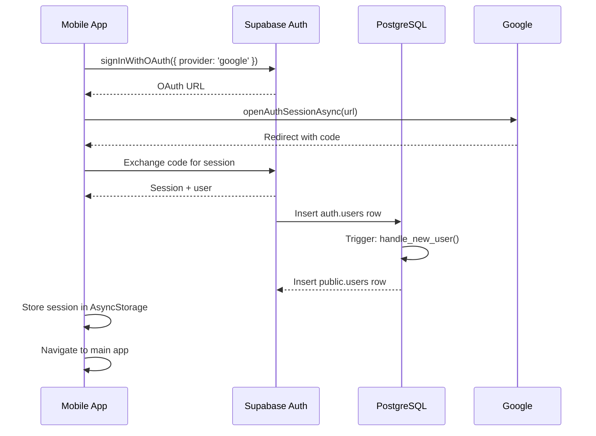
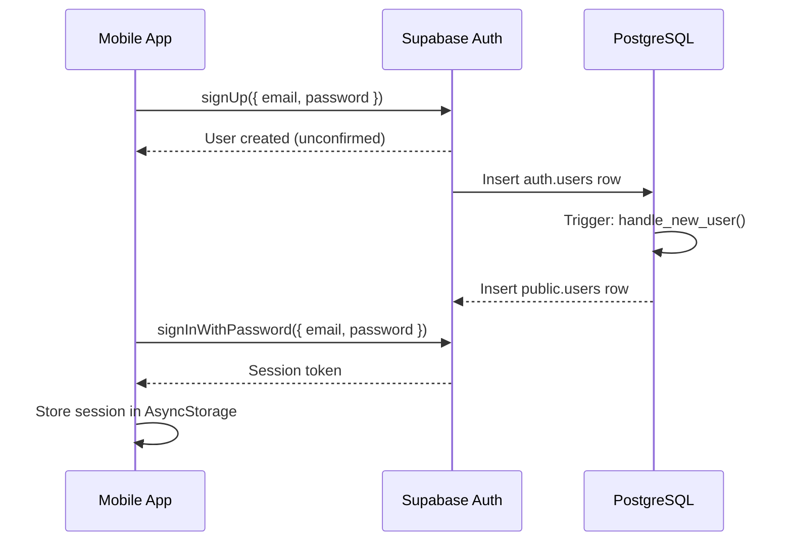
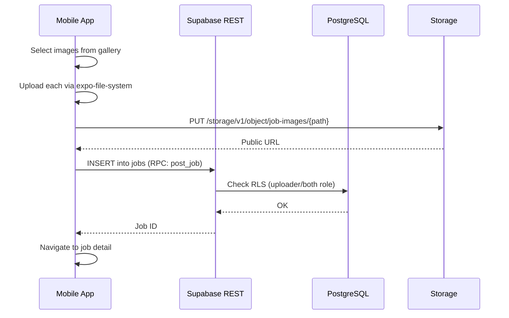
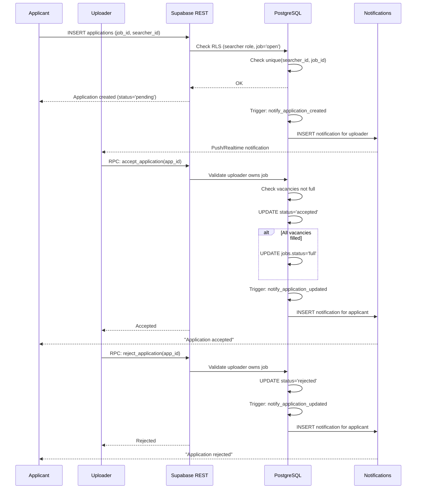
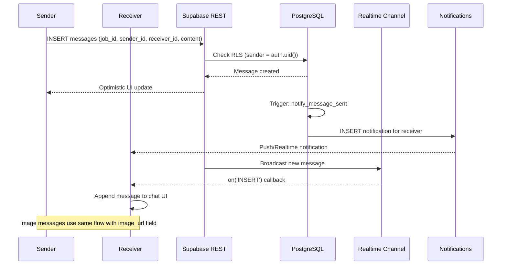
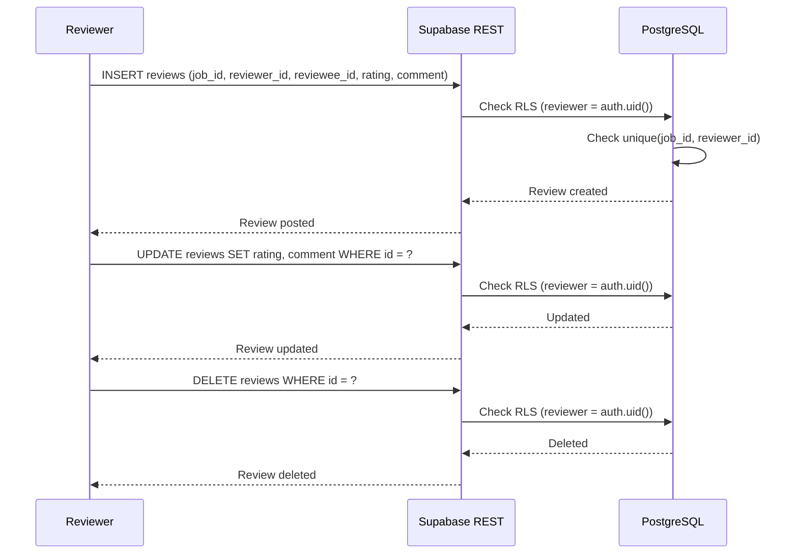
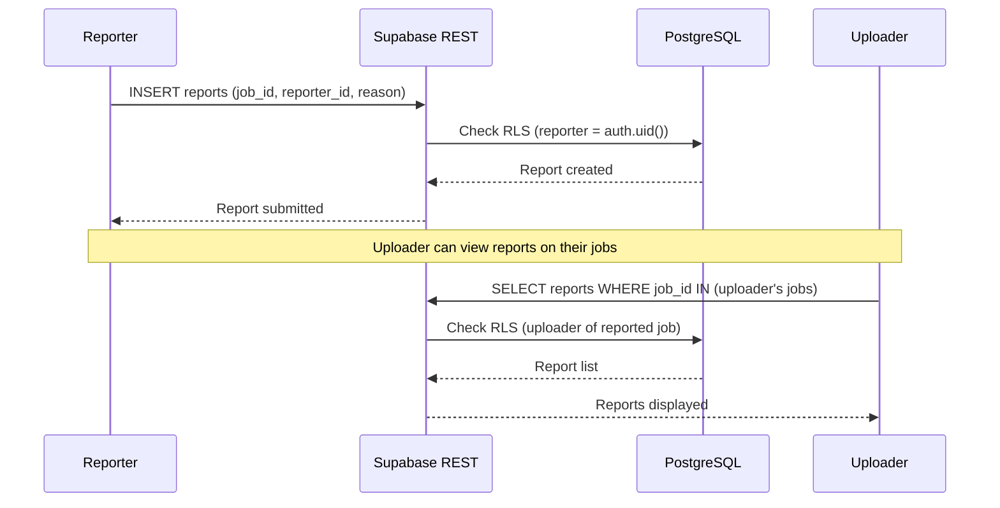

# LocJobs Database Design

## Overview

LocJobs uses **Supabase** (PostgreSQL) as its backend — handling Auth (via Supabase Auth), Row-Level Security (RLS), real-time subscriptions, storage, and database functions/triggers. There is **no application server**; the mobile app talks directly to Supabase.

---

## Enums

| Enum | Values | Description |
|------|--------|-------------|
| `user_role` | `'uploader'`, `'searcher'`, `'both'` | User type |
| `work_type` | `'onsite'`, `'remote'`, `'hybrid'` | Job work arrangement |
| `job_status` | `'open'`, `'accepted'`, `'full'`, `'completed'`, `'cancelled'` | Lifecycle of a job |
| `application_status` | `'pending'`, `'accepted'`, `'rejected'` | State of an application |

---

## Tables

### `users`
Extends `auth.users` (Supabase Auth).

| Column | Type | Constraints | Notes |
|--------|------|-------------|-------|
| `id` | `uuid` | PK → `auth.users(id)` ON DELETE CASCADE | Same as auth user ID |
| `display_name` | `text` | nullable | |
| `role` | `user_role` | NOT NULL DEFAULT `'both'` | |
| `location` | `geography(point)` | nullable | PostGIS — **not used** (migration 00003 dropped PostGIS) |
| `city` | `text` | nullable | |
| `region` | `text` | nullable | |
| `phone` | `text` | nullable | |
| `avatar_url` | `text` | nullable | |
| `bio` | `text` | nullable | |
| `verified` | `boolean` | NOT NULL DEFAULT `false` | Auto-set after 3 completed jobs |
| `deleted_at` | `timestamptz` | nullable | Soft delete timestamp |
| `created_at` | `timestamptz` | NOT NULL DEFAULT `now()` | |
| `updated_at` | `timestamptz` | NOT NULL DEFAULT `now()` | Auto-updated via trigger |

**Trigger**: `on_auth_user_created` — inserts a row into `public.users` when a new `auth.users` row is created.

---

### `jobs`

| Column | Type | Constraints | Notes |
|--------|------|-------------|-------|
| `id` | `uuid` | PK DEFAULT `gen_random_uuid()` | |
| `uploader_id` | `uuid` | FK → `users(id)` ON DELETE CASCADE NOT NULL | |
| `title` | `text` | NOT NULL | |
| `description` | `text` | nullable | |
| `work_type` | `work_type` | NOT NULL DEFAULT `'onsite'` | |
| `location` | `geography(point)` | nullable | PostGIS — not used |
| `address` | `text` | nullable | |
| `city` | `text` | nullable | |
| `region` | `text` | nullable | |
| `status` | `job_status` | NOT NULL DEFAULT `'open'` | |
| `price` | `numeric(10,2)` | nullable | |
| `image_urls` | `text[]` | DEFAULT `'{}'` | |
| `lat` | `double precision` | nullable | Client-side haversine used |
| `lng` | `double precision` | nullable | Client-side haversine used |
| `vacancies` | `integer` | NOT NULL DEFAULT `1` | |
| `category` | `text` | nullable | |
| `employment_type` | `text` | nullable | `'full_time'`, `'part_time'`, `'contract'`, `'freelance'`, `'internship'`, `'temporary'` |
| `salary_min` | `numeric` | nullable | |
| `salary_max` | `numeric` | nullable | |
| `salary_period` | `text` | nullable | `'hourly'`, `'daily'`, `'monthly'`, `'yearly'` |
| `deleted` | `boolean` | NOT NULL DEFAULT `false` | Soft delete flag |
| `created_at` | `timestamptz` | NOT NULL DEFAULT `now()` | |
| `updated_at` | `timestamptz` | NOT NULL DEFAULT `now()` | |

**Indexes**: `city`, `status`, `created_at DESC`, `work_type`, `lat`/`lng` (used in nearby_jobs RPC)

**RLS**: Anyone can SELECT; only uploader (role `'uploader'`/`'both'`) can INSERT with `auth.uid() = uploader_id`; only uploader can UPDATE/DELETE their own.

---

### `applications`

| Column | Type | Constraints | Notes |
|--------|------|-------------|-------|
| `id` | `uuid` | PK DEFAULT `gen_random_uuid()` | |
| `job_id` | `uuid` | FK → `jobs(id)` ON DELETE CASCADE NOT NULL | |
| `searcher_id` | `uuid` | FK → `users(id)` ON DELETE CASCADE NOT NULL | |
| `status` | `application_status` | NOT NULL DEFAULT `'pending'` | |
| `message` | `text` | nullable | Cover letter from applicant |
| `reject_reason` | `text` | nullable | Reason from uploader |
| `created_at` | `timestamptz` | NOT NULL DEFAULT `now()` | |

**Unique**: `(searcher_id, job_id)` — one application per user per job.

**RLS**:
- INSERT: searcher role, job must be `'open'`
- SELECT: own applications OR uploader of the job
- UPDATE: only uploader (via `accept_application` / `reject_application` RPCs)

**Functions**:
- `accept_application(p_application_id)` — validates vacancies, sets status to `'accepted'`, sets job to `'full'` if all filled
- `reject_application(p_application_id)` — validates ownership, sets status to `'rejected'`

---

### `messages`

| Column | Type | Constraints | Notes |
|--------|------|-------------|-------|
| `id` | `uuid` | PK DEFAULT `gen_random_uuid()` | |
| `job_id` | `uuid` | FK → `jobs(id)` ON DELETE CASCADE NOT NULL | |
| `sender_id` | `uuid` | FK → `users(id)` ON DELETE CASCADE NOT NULL | |
| `receiver_id` | `uuid` | FK → `users(id)` ON DELETE CASCADE NOT NULL | |
| `content` | `text` | NOT NULL | |
| `image_url` | `text` | nullable | Image message |
| `edited_at` | `timestamptz` | nullable | |
| `deleted` | `boolean` | NOT NULL DEFAULT `false` | |
| `created_at` | `timestamptz` | NOT NULL DEFAULT `now()` | |

**Realtime**: `supabase_realtime` publication includes this table.

**RLS**: Participants can SELECT (sender or receiver); authenticated users can INSERT as sender.

---

### `notifications`

| Column | Type | Constraints | Notes |
|--------|------|-------------|-------|
| `id` | `uuid` | PK DEFAULT `gen_random_uuid()` | |
| `user_id` | `uuid` | FK → `users(id)` ON DELETE CASCADE NOT NULL | |
| `type` | `text` | NOT NULL | `'new_application'`, `'application_accepted'`, `'application_rejected'`, `'new_message'`, `'job_completed'` |
| `title` | `text` | NOT NULL | |
| `body` | `text` | NOT NULL | |
| `data` | `jsonb` | DEFAULT `'{}'` | Job/sender IDs for navigation |
| `read` | `boolean` | NOT NULL DEFAULT `false` | |
| `created_at` | `timestamptz` | NOT NULL DEFAULT `now()` | |

**Realtime**: `supabase_realtime` publication includes this table.

**Auto-creation triggers**:
- `notify_application_created` — on INSERT to `applications`
- `notify_application_updated` — on UPDATE to `applications.status`
- `notify_message_sent` — on INSERT to `messages`
- `notify_job_completed` — on UPDATE `jobs.status → 'completed'`

---

### `saved_jobs`

| Column | Type | Constraints | Notes |
|--------|------|-------------|-------|
| `id` | `uuid` | PK DEFAULT `gen_random_uuid()` | |
| `user_id` | `uuid` | FK → `users(id)` ON DELETE CASCADE NOT NULL | |
| `job_id` | `uuid` | FK → `jobs(id)` ON DELETE CASCADE NOT NULL | |
| `created_at` | `timestamptz` | NOT NULL DEFAULT `now()` | |

---

### `reviews`

| Column | Type | Constraints | Notes |
|--------|------|-------------|-------|
| `id` | `uuid` | PK DEFAULT `gen_random_uuid()` | |
| `job_id` | `uuid` | FK → `jobs(id)` ON DELETE CASCADE NOT NULL | |
| `reviewer_id` | `uuid` | FK → `users(id)` ON DELETE CASCADE NOT NULL | |
| `reviewee_id` | `uuid` | FK → `users(id)` ON DELETE CASCADE NOT NULL | |
| `rating` | `integer` | NOT NULL CHECK (1–5) | |
| `comment` | `text` | nullable | |
| `created_at` | `timestamptz` | NOT NULL DEFAULT `now()` | |

**Unique**: `(job_id, reviewer_id)` — one review per job per reviewer.

**RLS**: Anyone can SELECT; authenticated user can INSERT (as reviewer); reviewer can UPDATE/DELETE own review.

---

### `reports`

| Column | Type | Constraints | Notes |
|--------|------|-------------|-------|
| `id` | `uuid` | PK DEFAULT `gen_random_uuid()` | |
| `job_id` | `uuid` | FK → `jobs(id)` ON DELETE CASCADE NOT NULL | |
| `reporter_id` | `uuid` | FK → `users(id)` ON DELETE CASCADE NOT NULL | |
| `reason` | `text` | NOT NULL | |
| `created_at` | `timestamptz` | NOT NULL DEFAULT `now()` | |

**RLS**: Authenticated users can INSERT; uploader can SELECT reports on their jobs.

---

## RLS Summary

| Table | SELECT | INSERT | UPDATE | DELETE |
|-------|--------|--------|--------|--------|
| `users` | Public | Own record only (`auth.uid() = id`) | Own record only (`auth.uid() = id`) | — |
| `jobs` | Public | `auth.uid() = uploader_id` AND role is uploader/both | `auth.uid() = uploader_id` | `auth.uid() = uploader_id` |
| `applications` | Self OR uploader of job | Searcher role, job must be `open` | Uploader of job (via RPC) | — |
| `messages` | Participant (sender/receiver) | `auth.uid() = sender_id` | — | — |
| `notifications` | Own only (`auth.uid() = user_id`) | System (no check) | Own only | — |
| `saved_jobs` | Own only | Own only | — | Own only |
| `reviews` | Public | `auth.uid() = reviewer_id` | `auth.uid() = reviewer_id` | `auth.uid() = reviewer_id` |
| `reports` | Uploader of reported job | `auth.uid() = reporter_id` | — | — |

---

## Key Functions

| Function | Purpose |
|----------|---------|
| `handle_new_user()` | Trigger: auto-creates `public.users` row on signup |
| `notify_application_created()` | Trigger: notification to uploader on new application |
| `notify_application_updated()` | Trigger: notification to applicant on status change |
| `notify_message_sent()` | Trigger: notification to message receiver |
| `notify_job_completed()` | Trigger: notification to accepted applicants |
| `accept_application(uuid)` | RPC: uploader accepts an application (vacancy-aware) |
| `reject_application(uuid)` | RPC: uploader rejects an application |
| `nearby_jobs(lat, lng, radius)` | RPC: spatial query using haversine formula |
| `post_job(...)` | RPC: insert job with full parameter set |
| `check_user_verification(uuid)` | Function: auto-verifies user after 3 completed jobs |

---

## Entity Relationship Diagram

```
auth.users
    │
    ├── 1:1 ── public.users
    │              │
    │              ├── 1:N ── public.jobs (uploader_id)
    │              │              │
    │              │              ├── 1:N ── public.applications (job_id)
    │              │              │              │
    │              │              │              └── N:1 ── public.users (searcher_id)
    │              │              │
    │              │              ├── 1:N ── public.messages (job_id)
    │              │              │              │
    │              │              │              ├── N:1 ── public.users (sender_id)
    │              │              │              └── N:1 ── public.users (receiver_id)
    │              │              │
    │              │              ├── 1:N ── public.saved_jobs (job_id)
    │              │              │              │
    │              │              │              └── N:1 ── public.users (user_id)
    │              │              │
    │              │              ├── 1:N ── public.reviews (job_id)
    │              │              │              │
    │              │              │              ├── N:1 ── public.users (reviewer_id)
    │              │              │              └── N:1 ── public.users (reviewee_id)
    │              │              │
    │              │              └── 1:N ── public.reports (job_id)
    │              │                           │
    │              │                           └── N:1 ── public.users (reporter_id)
    │              │
    │              └── 1:N ── public.notifications (user_id)
```

---

## Sequence Diagrams

### 1. Authentication Flow (Google OAuth)



### 2. Email/Password Authentication



### 3. Job Posting Flow



### 4. Job Application Flow (Apply → Accept/Reject)



### 5. Real-time Chat Flow



### 6. Review Flow



### 7. Report / Flag Flow



---

## Storage

**Bucket**: `job-images` (public)

Used for job image uploads. Uploaded via `expo-file-system/legacy` `uploadAsync` with `BINARY_CONTENT` + `PUT` method + auth token.

---

## Real-time Subscriptions

| Channel | Table | Purpose |
|---------|-------|---------|
| `supabase_realtime` | `messages` | Live chat |
| `supabase_realtime` | `notifications` | Live notification badges |

---

## Migration History

| # | File | Purpose |
|---|------|---------|
| 00001 | `schema.sql` | Core schema: users, jobs, acceptances, RLS, triggers |
| 00002 | `missing_columns.sql` | avatar_url on users |
| 00003 | `nopostgis.sql` | Remove PostGIS, switch to lat/lng columns |
| 00004 | `slots.sql` | Add slots column to jobs |
| 00005 | `messages.sql` | Chat table + realtime |
| 00006 | `apply.sql` | accept → applications, 'full' status, unique constraint |
| 00007 | `application_status.sql` | Application accept/reject flow with RPCs |
| 00008 | `notifications.sql` | Notifications table + auto-create triggers |
| 00009 | `chat_images.sql` | image_url on messages |
| 00010 | `google_oauth.sql` | Handle Google OAuth display_name |
| 00011 | `saved_jobs.sql` | Saved/bookmark jobs |
| 00012 | `reviews.sql` | Ratings & reviews |
| 00013 | `category.sql` | Category column on jobs |
| 00014 | `post_job_category.sql` | Update post_job RPC for category |
| 00015 | `verified.sql` | Verified badge + auto-verify function |
| 00016 | `reports.sql` | Report/flag table |
| 00017 | `application_message.sql` | Cover letter message on applications |
| 00018 | `reject_reason.sql` | Reject reason on applications |
| 00019 | `bio.sql` | Bio column on users |
| 00020 | `delete_job_account.sql` | Soft delete for jobs/users |
| 00021 | `employment_type.sql` | Employment type + salary fields |
| 00022 | `reviews_delete_policy.sql` | DELETE RLS for reviews |
